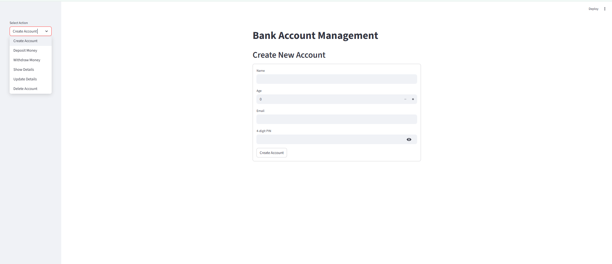
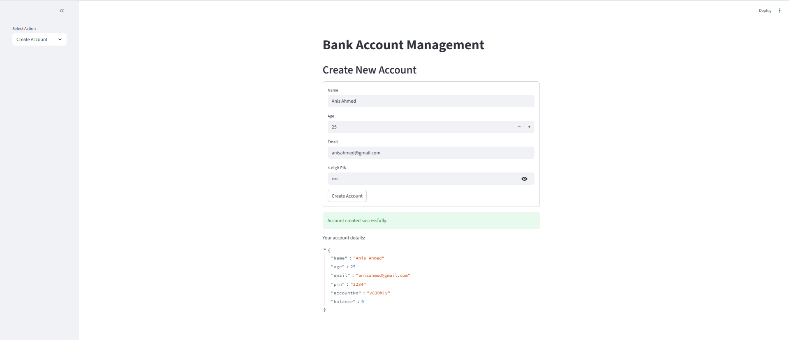
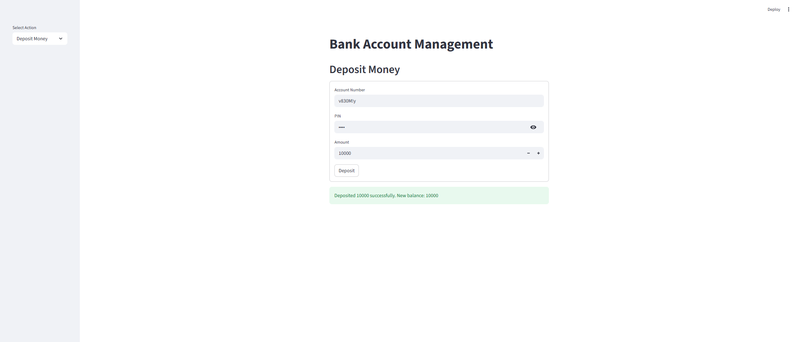

# 🏦 FinTech Application: Secure Account Management System (Python + Streamlit)

A simple banking system built with Python, Streamlit, and JSON-based storage.  
It allows users to create accounts, deposit/withdraw money, update profile details, and delete accounts—all through a lightweight web UI.

---

### 🔧 Tech Stack
- Python
- Streamlit
- JSON (local file storage)

---

### 🚀 Features
- Create account (auto-generated account number)
- Deposit & withdraw balance
- Update name, email, and PIN
- Delete account
- PIN stored as string to allow leading zeros (e.g., "0123")

---

### ⚙️ Setup & Installation

```bash
pip install -r requirements.txt
streamlit run app.py
```

---

### 📂 Project Structure

```
📂 bank-account-management-python/
├── bank.py                # Core banking logic (CRUD operations)
├── app.py                 # Streamlit UI
├── requirements.txt       
├── README.md
└── screenshots/
    ├── home.png
    ├── create_account.png
    └── deposit.png
```

---

### 🖥️ Demo Preview

  
  


---

### 🗄️ Data Format Example (JSON)

```json
[
  {
    "Name": "Anis Ahmed",
    "age": 25,
    "email": "anisahmed@gmail.com",
    "pin": "1234",
    "accountNo": "v830M!y",
    "balance": 10000
  }
]
```
